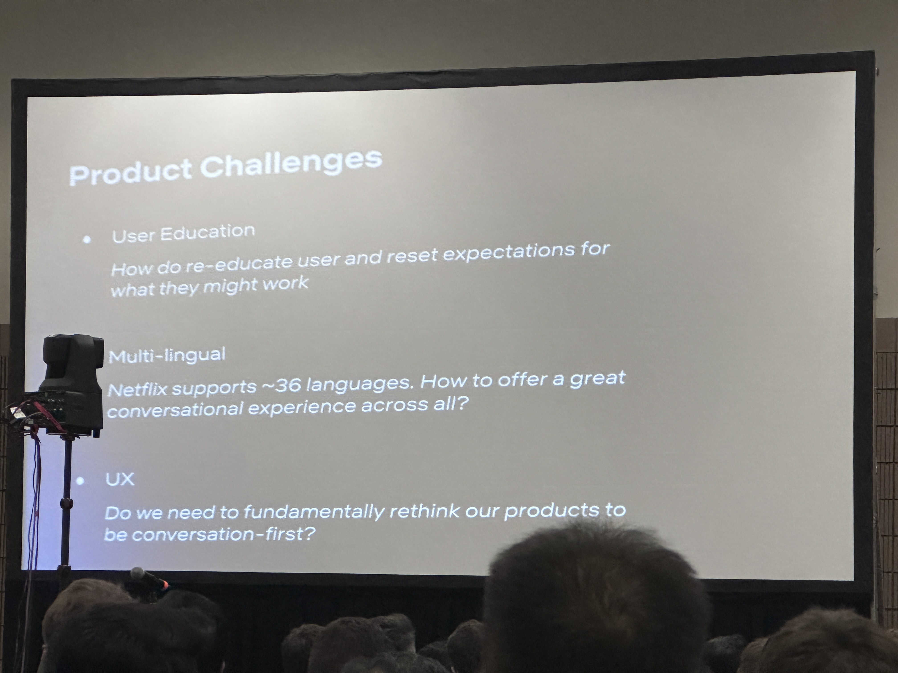
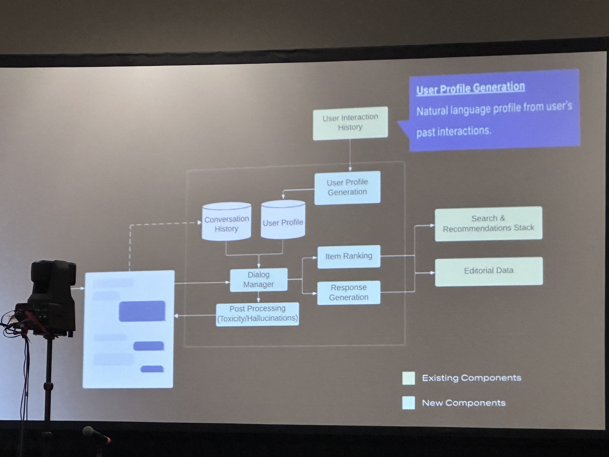
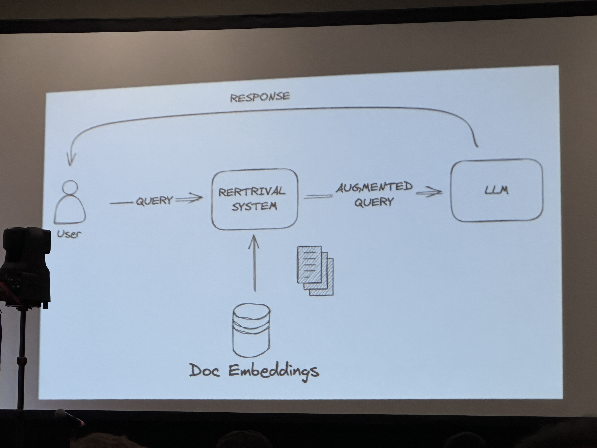
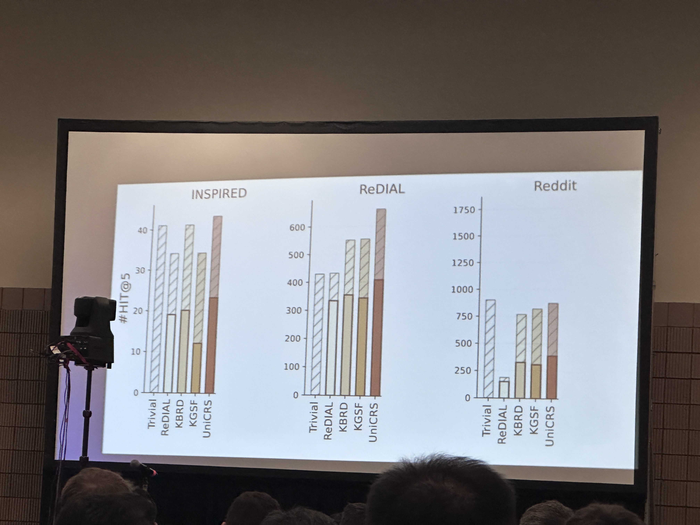
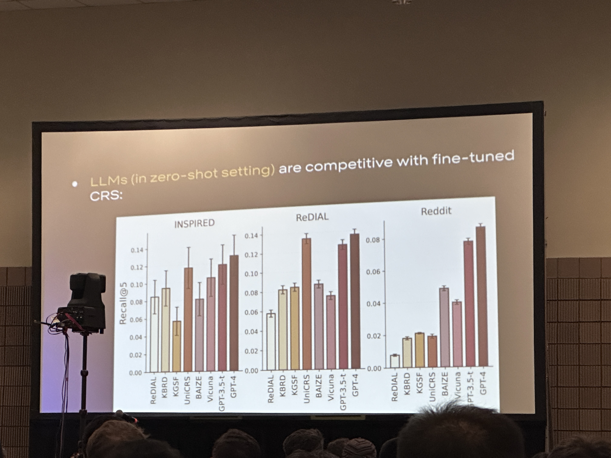
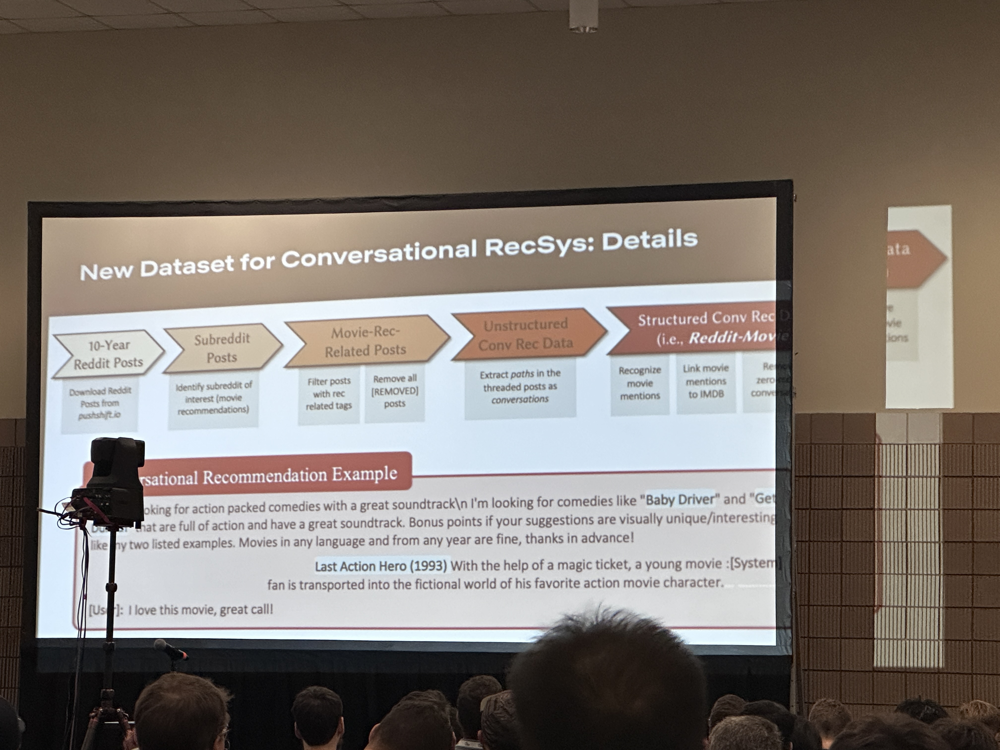

## Accuracy but High recall
Limit to domain of items we have
- *Tell me about the film starting Taylor Swift, where she goes to the ML conference, NeurIPS, and hilarity ensues?*
- The film is a lighthearted comedy with a focus on the clash between Taylor Swift's celebrity lifestyle and the often-nerdy of AI research 

## Ranking
- By LLM logits?
- By relevance to the query?
- By popularity?
- By collab-filter score?

## Vague User-Intent
> Sometimes there isn't a clear intent to satisfy

## Systems Challenge
- Latency / Throughput
- Inference cost
	Forbes: What Large Model Cost You - There is No Free AI Lunch
- Uptime / Availability

## Contamination
> And if it all works, then what?

## User Profile Generation
- One strategy: **summarize user history into a natural language user profile**
- *Many strategies:*
	- Summarize entire user interaction history
	- Retrieve relevant parts, based on the current state
	- But still an open question

## Response Generation
- Being able to respond in LLM

# Evaluating Conversation System
## Which one should we evaluate
- Recall of held-out items-interactions
- Quality of explanations (factual, relevant, ...)

## QnA
1. Reddit open source dataset
2. 