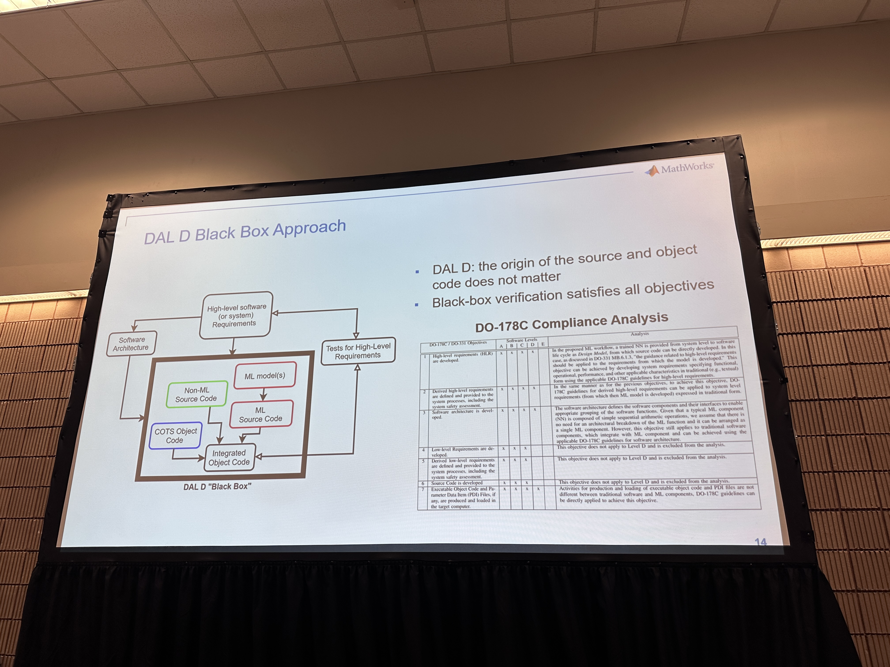

> AI 는 다양한 도메인에 critical 하게 사용된다. 

### Contents
- AI Certification in Airborne Systems: an Overview
- Certifying DAL D; A Case Study: Runway Sign Classifier
- Towards DAL C

## 왜 항공 분야에서 인증가능한 AI가 필요할까?
### What is DO-178C?
> software standard document published by the Radio Technical Commission for Aeronautics(RTCA)
	-> 항공기, 헬리콥터, 무인 항공기(UAVs), 우주선을 포함한 항공 장비 및 시스템의 소프트웨어 설계 및 개발을 위한 지침을 제공하는 소프트웨어 표준 문서

DO-178C는 소프트웨어 오류가 항공기의 안전이나 운영에 미치는 잠재적 영향에 기초하여 다섯 가지 소프트웨어 레벨을 정의합니다. 이러한 각 레벨은 Design Assurance Level (DAL)이라고 불리며, 실패 상태에 따라 A부터 E까지 등급이 매겨집니다.

- Level A: Catastrophic (재난적인)
- Level B: Hazardous (위험한)
- Level C: Major (중대한)
- Level D: Minor (경미한)
- Level E: No Safety Effect (안전에 영향 없음)

또한 "Long Service History (1982-2023)"와 "Built trust"라는 문구가 있어, DO-178C 표준이 오랜 기간 동안 업계의 신뢰를 쌓아왔음을 나타냅니다. 이는 항공 소프트웨어의 품질과 안전성을 보장하기 위한 중요한 기준으로 인식되고 있음을 의미합니다.

## Why is Machine Learning Certification a problem?

> [!NOTE]
항공 소프트웨어 내에서 기계 학습 구성 요소를 통합하고 DO-178C 기준에 따라 인증하는 방법에 대한 질문을 제시합니다. 또한, 기계 학습에 대한 새로운 검증 방법에서 신뢰를 구축하는 방법에 대한 의문을 표합니다.

- "기계 학습 인증이 왜 문제인가?"
- "여러 DO-178C 목표들은 기계 학습 구성 요소가 있는 소프트웨어에 직접 적용될 수 없습니다."
- "기계 학습이 항공 소프트웨어에 어떻게 통합되고 DO-178C에 대해 인증될 수 있을까요?"
- "기계 학습에 대한 새로운 검증 방법에서 우리는 어떻게 신뢰를 구축할 수 있을까요?"

이 슬라이드는 기계 학습 기술이 항공 분야의 엄격한 안전 기준에 맞추어 검증되고 인증되어야 한다는 중요성을 강조하고 있으며, 이러한 신기술을 기존의 안전 프레임워크 내에서 통합하는 방법에 대한 산업의 고민을 반영한다. 

-> MathWorks는 항공 우주 분야의 작업 그룹(EUROCAE WG-114 / SAE-34)에서 활동적인 역할을 하고 있음을 보여줍니다. 이 그룹은 ARINC 6983에 따라 인공 지능(AI)을 구현하는 항공 안전 관련 제품의 개발과 인증/승인에 관한 표준을 다루고 있습니다.

## How big is the gap between Machine Learning and Traditional Software Development?

이 슬라이드는 기계 학습(ML)과 전통적인 소프트웨어 개발 간의 차이점에 대해 설명합니다. DO-178C 표준의 71개 목표 중 15개가 기계 학습과 호환되지 않는다고 언급하고 있습니다. 이는 기계 학습 기반의 개발이 데이터 주도적인 접근 방식을 사용하고, 전통적인 규칙 기반(rule-based) 소프트웨어 개발과는 다른 도전과제를 가지고 있음을 나타냅니다.

슬라이드는 다음과 같은 세 가지 주요 개념을 강조합니다:

- **Coverage(범위)**: 전통적인 소프트웨어 개발에서는 "if" 문과 같은 명확한 규칙으로 로직이 정의되지만, 기계 학습에서는 입력과 출력 사이의 관계가 복잡한 네트워크에 의해 결정되므로 전체 범위를 이해하고 설명하기가 더 어렵습니다.
- **Traceability(추적성)**: 규칙 기반 개발에서는 코드 내의 각 명령어가 어떻게 실행되는지 추적할 수 있지만, 기계 학습에서는 숨겨진 레이어(hidden layers)로 인해 어떤 특정 입력이 특정 출력으로 어떻게 변환되는지 추적하기가 더 복잡합니다.
- **Explainability(설명 가능성)**: 규칙 기반 시스템은 결정 과정을 설명하는 것이 상대적으로 간단하지만, 기계 학습 모델은 "블랙 박스"처럼 작동할 수 있어서 왜 특정 결정이 내려졌는지 설명하기가 더 어렵습니다.

이러한 차이점들은 항공우주 분야에서 기계 학습을 적용하고 인증하는 데 있어 중요한 고려사항입니다. 기계 학습 모델의 결정들이 안전에 직접적인 영향을 미칠 수 있기 때문에, 이러한 모델이 어떻게 작동하는지를 이해하고 정확하게 설명할 수 있는 능력은 매우 중요합니다.
## Can we certify Machine Learning now?
기계 학습(ML) 시스템의 인증 가능성에 대해 두 가지 접근 방식이 제시되고 있다. 

1. **DAL D ML Workflow**:
    - 이 접근법은 "블랙박스"로 ML 시스템을 취급합니다.
    - 기존 표준(DO-178C, ARP4754, DO-254)에 기반합니다.
2. **DAL C ML Workflow**:
    - 기존 표준을 기반으로 하면서 추가적인 구조적 완화(mitigation)와 ML에 특화된 새로운 검증 및 검사(VnV) 절차를 포함합니다.

인증을 위한 접근 방식은 시스템의 중요도에 따라 결정되며, 각 Design Assurance Level (DAL)은 실패가 발생할 경우의 결과에 따라 다음과 같이 정의됩니다:

- **DAL A (Catastrophic)**: 총 71개 목표 중 30개는 독립성을 요구합니다.
- **DAL B (Hazardous)**: 총 69개 목표 중 18개는 독립성을 요구합니다.
- **DAL C (Major)**: 총 62개 목표 중 5개는 독립성을 요구합니다.
- **DAL D (Minor)**: 총 26개 목표 중 2개는 독립성을 요구합니다.
- **DAL E (No Safety Effect)**: 필수 목표 없음.

이 슬라이드는 기계 학습이 항공우주 소프트웨어의 안전 관련 부분에서 인증 과정을 거치는 데 있어 어떤 방식으로 접근해야 하는지에 대한 논의를 제시합니다. 특히 낮은 위험도를 가진 ML 시스템에 대한 점진적 인증 접근법을 설명하고 있습니다.

## Dal D Black Box Approach

'블랙박스'란 소스 코드와 객체 코드의 기원이 중요하지 않다는 것을 의미합니다. 이 접근 방식에서는 블랙박스 검증이 모든 목표를 충족시킵니다.

소프트웨어 아키텍처는 다음과 같이 구성됩니다:

- **고수준 소프트웨어 또는 시스템 요구사항**: 시스템이 충족해야 할 전반적인 기능과 성능 관련 요구사항을 정의합니다.
- **비ML 소스 코드(Non-ML Source Code)**: 기계 학습이 아닌 전통적인 소스 코드 부분입니다.
- **ML 모델(s) 소스 코드(ML Source Code)**: 기계 학습 모델과 관련된 소스 코드 부분입니다.
- **COTS(Commercial Off-The-Shelf) 객체 코드(COTS Object Code)**: 시장에서 구입하여 사용하는 소프트웨어 컴포넌트로, 특정한 표준에 따라 인증된 제품일 수 있습니다.
- **통합 객체 코드(Integrated Object Code)**: 위의 모든 코드가 통합된 최종 실행 가능한 소프트웨어입니다.

**DAL D "Black Box"**: 이 접근법에서는 통합된 객체 코드를 '블랙박스'로 취급하여, 내부 작동 방식보다는 외부에서 관찰되는 행동과 출력에 초점을 맞춥니다.

## W-shaped development process

  
이 슬라이드는 전통적인 V-모델 소프트웨어 개발 프로세스와 기계 학습(ML) 구성 요소를 통합하는 W-모델 개발 프로세스를 비교하고 있습니다. 여기서, 전통적인 V-모델은 소프트웨어의 설계와 테스트 단계를 선형적이고 계획적인 순서로 나열하며, 개발의 각 단계가 다음 단계로 진행하기 전에 완료되어야 합니다.

반면에, W-모델은 ML 구성 요소의 개발을 위해 더 많은 검증 단계를 추가함으로써 V-모델을 확장합니다. 이는 데이터 관리, 학습 프로세스 관리, 모델 훈련, 학습 프로세스 검증, 모델 구현 및 추론 모델 검증 및 통합을 포함합니다. 이러한 추가 단계는 ML 구성 요소가 신뢰할 수 있고 안전 기준을 충족할 수 있도록 보장합니다.

슬라이드에 표시된 W-모델의 양쪽 끝은 전통적인 소프트웨어 요구 사항과 ML 구성 요소 사이의 연결을 나타내며, 각각의 개발 단계는 EASA(European Union Aviation Safety Agency)의 지침에 따라 수행됩니다. 이러한 프로세스는 기계 학습 구성 요소가 포함된 소프트웨어의 안전성과 신뢰성을 보장하기 위한 것입니다
# DAL D 사례 연구: 활주로 표지판 분류기

> [!NOTE]
> 위에서 설명한 W-모델 개발 프로세스에 따라 활주로 표지판 분류기를 실생활에 적용한다. 

#### Data management
희박한 확률로 데이터셋에서 잘못된 데이터가 발생한다. 이를 수정한다. 
#### Manage, train and verify the learning process
*train*
- 모델을 학습시킨다. 
- YOLO의 버전을 달리해가며 학습시켰다. (YOLO v2, v3, v4)
*verify*
- YOLO v3가 95% 정도의 정확도로 가장 높았다. 
#### Deploy to target with zero coding erros
#### Generating code for Deep Neural Network
#### Quantization, compression and code generation
quantized 한 이후에도 정확도가 0.9957 정도로 매우 높게 나왔다. 
#### Requirements 

# Towards DAL C
- 여러 데이터 Augmentation에 대해서 다양하게 test해봄으로써 안정성을 다시 검사한다. 
- 값을 추가로 설정하여 재검증하는 절차도 거칠 수 있다. 
	*안개(fog)를 추가하여 값을 test했을 때 거의 맞추지 못하는 경우를 확인할 수 있었다.* 
## Can we tackle DAL C today?
- Measure Dissimilarity를 비교하기 위한 많은 방법들이 존재한다. 
From Theory to Practice Incorporating ML Models into Safety-Critical SystemsFrom Theory to Practice Incorporating ML Models into Safety-Critical Systems

